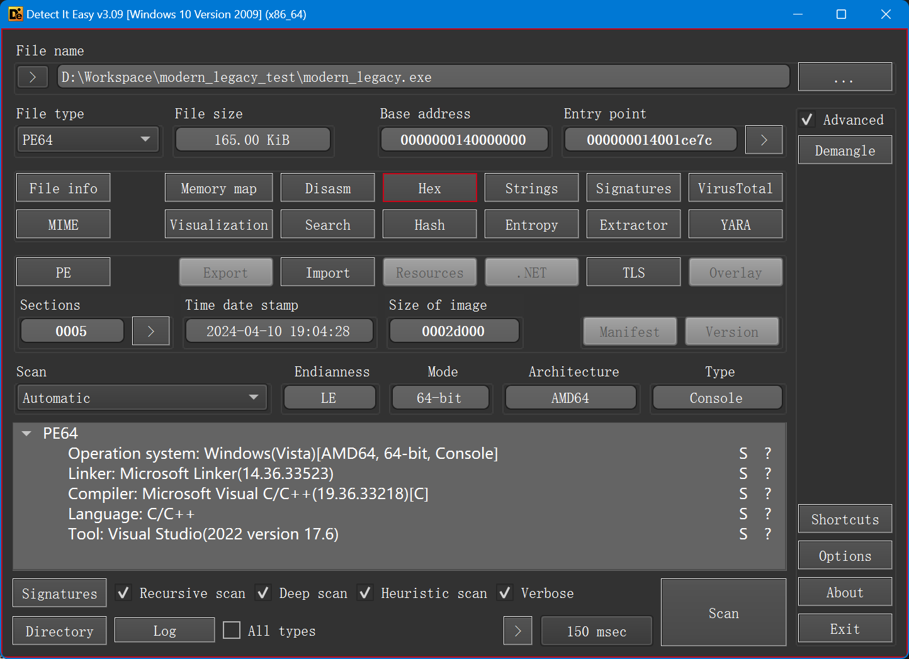
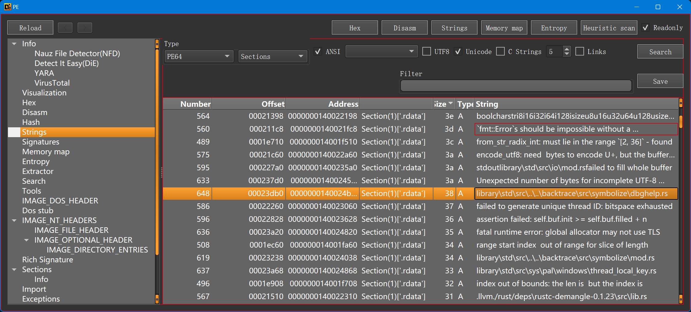
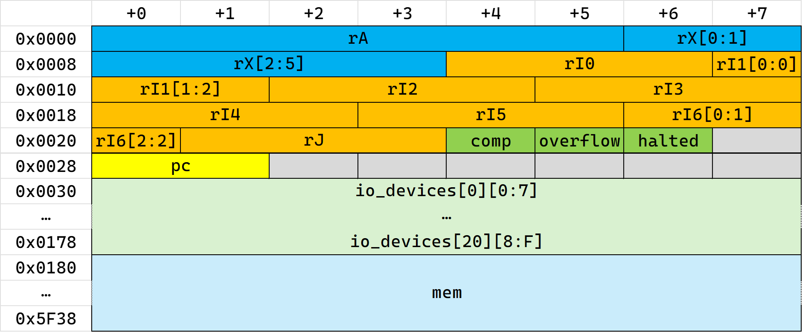
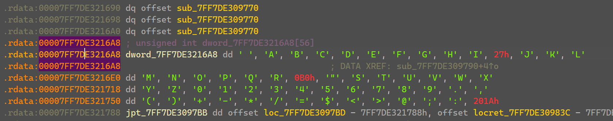

# Author's writeup for `modern_legacy`

## 1. Info gathering

By running the executable, we can see that it takes a string as input, checks the flag and prints corresponding message on success or failure.

```text
PS D:\Workspace\modern_legacy_test> .\modern_legacy.exe
EXPL0RE 1960S' PAST 1N 4 PRESENT W0RLD 
WHAT DID YOU UNCOVER, ELITE RUSTACEAN >>
aaaabaaacaaadaaaeaaafaaagaaahaaaiaaajaaakaaa
THAT IS NOT CORRECT. TRY AGAIN :D
PS D:\Workspace\modern_legacy_test>
```

By repeatedly running the program with varying lengths of inputs, we notice that it only exit reading loop after reading in at least 35 characters, line breaks does not break its reading loop. This suggest that it does not use `gets`- or `scanf("%Ns", ...)`-like input functions.

Passing the given executable through DIE reveals little-to-no info: This exe seems to be a regular program compiled with MSVC written in "C". However, observing strings can make us speculate that this is actually a Rust application. We can also notice that none of the prompt strings (`b"EXPL0RE 1960S' PAST 1N 4 PRESENT W0RLD"`, `b"WHAT DID YOU UNCOVER, ELITE RUSTACEAN >>"`, `b"THAT IS NOT CORRECT. TRY AGAIN :D"`) can be found as literals in the executable.




By using the all-mighty IDA we can confirm our guesses; the entry point aligns well with Rust's typical pattern when using MSVC as its backend.

```c
int __fastcall main(int argc, const char **argv, const char **envp)
{
  char v4; // [rsp+20h] [rbp-18h]
  __int64 (__fastcall *v5)(); // [rsp+30h] [rbp-8h] BYREF

  v5 = sub_140008C40;
  v4 = 0;
  return sub_140013270(&v5, &off_1400219A0, argc, argv, v4);
}
```

Thus `sub_140008C40` should be our main function, as for Rust it should have the name `modern_legacy__main`. And we simply denote this function as `main` hereafter.

## 2. Static analysis

This construct in `main` is of greatest interest, as it resembles a typical VM's stepping loop:

```c
do
{
  result = sub_140005200(v21);
  if ( (_BYTE)result != 8 )
  {
    HIBYTE(v20) = result;
    sub_14001DC70(
      (unsigned int)"called `Result::unwrap()` on an `Err` value",
      43,
      (unsigned int)&v20 + 7,
      (unsigned int)&off_1400211A0,
      (__int64)&off_140021570);
  }
}
while ( !v22 );
```

`sub_140005200(void *a1)` does the following jobs:

0. Returns directly with retval `7` if `*((_BYTE *)a1 + 38)` is truthy;
0. Checks if `(v2 = *((unsigned __int16 *)a1 + 20)) < 4000` holds, panic if it's not the case;
0. Perform some operations on `*(_DWORD *)((char *)a1 + 6 * v2 + 384)`, extracting `v3`, `v4`, etc. from said operations;
0. `*((unsigned __int16 *)a1 + 20) = v2 + 1`;
0. Enter a large `switch` over `v3`, calling many spatially-adjacent functions;
0. Returns with result of last step.

Thus it is obviously a VM's decoding and dispatching function. We can also deduce that the VM also handles IO operations and character transformations, as no prompt strings are stored literally.

> [!NOTE]
> After re-visiting hints `EXPL0RE 1960S' PAST 1N 4 PRESENT W0RLD `, someone may guess that this VM simulates [D. E. Knuth](https://en.wikipedia.org/wiki/Donald_Knuth)'s MIX or one of its variants. For more information and its architecture, see TAOCP Volume 1 or the corresponding [webpage](https://esolangs.org/wiki/MIX_(Knuth)) on Esolangs.org.
>
> The knowledge of MIX would greatly enhance your progress. If you are familiar with MIX already, you may skip the instruction handlers' reverse-engineering part below, and jump straight to MIX bytecode extraction.

Now it's time to reconstruct the VM control structure. This part is tedious so we will not detail every single step here. We simply outline key steps below.

The aforementioned `a1` is obviously the start of VM control structure. `*((unsigned __int16 *)a1 + 20)` is obviously the program counter (PC), with a value less than 4000 (aka `0xFA0`). It is also trivial to (possibly temporarily) define `*((_BYTE *)a1 + 38)` as something like `not_running` or `halted`.

From the expression `((char *)a1 + 6 * v2 + 384)` we can see that the presumed-to-be instructions are fetched 6 bytes a time, starting from offset 384 relative to `a1`. Thus we may assume that this machine works in words of 6 bytes.

`sub_140006EE0` has an interesting structure:

```c
char __fastcall sub_140006EE0(unsigned int *a1, unsigned __int8 *a2)
{
  ...

  if ( (_BYTE)v3 )
  {
LABEL_12:
    LODWORD(v15) = v3 >> 8;
  }
  else
  {
    v9 = HIWORD(v3);
    if ( (unsigned int)v9 >= 0xFA0 )
      sub_14001DA50(v9, 4000i64, &off_140020DE8);
    v10 = (unsigned int *)((char *)a1 + 6 * v9 + 384);
    v11 = a2[2];
    if ( v11 == 7 )
    {
      ...
    }
    else
    {
      v16 = *a1;
      v18 = _byteswap_uint64(v16 & 0xFFFFFFFFFFFFFF00ui64 | ((unsigned __int64)*((unsigned __int16 *)a1 + 2) << 32)) >> 16;
      v19 = -(__int64)v18;
      if ( !(_BYTE)v16 )
        v19 = v18;
      v20 = *v10 | ((unsigned __int64)*((unsigned __int16 *)v10 + 2) << 32);
      v29[0] = (unsigned int)v11 >> 3;
      v29[1] = v11 & 7;
      v30 = 0;
      v22 = sub_140009470(v20, v29);
      v23 = a2[4];
      if ( v23 == 1 )
      {
        v15 = v19 + v22;
      }
      else
      {
        if ( v23 != 2 )
          sub_14001D9B0("internal error: entered unreachable code", 40i64, &off_140020E18);
        v15 = v19 - v22;
      }
      v26 = -v15;
      if ( v15 > 0 )
        v26 = v15;
      v27 = _byteswap_uint64(v26);
      *((_WORD *)a1 + 2) = HIWORD(v27);
      *a1 = ((unsigned __int64)v15 >> 63) | (v27 >> 16) & 0xFFFFFF00;
      LOBYTE(v15) = 8;
      if ( (v27 & 0xFFFFFF) != 0 )
        *((_BYTE *)a1 + 37) = 1;
    }
  }
  return v15;
}
```

Depending on `v23`, `v15` is stored with either `v19 + v22` or `v19 - v22`. Its two operands comes from `*a1` and `sub_140009470(v20, v29)`. `v15` is then stored back to `*a1` in an awkward way, with `*((_BYTE *)a1 + 37)` set if some condition is met. We may generally assume that some first bytes of VM control structure is a register, and it's used as ALU's destination. Observing the bitmasks involved the calculation of `*((_BYTE *)a1 + 37)`, we see that it is set to 1 if the lower 3 bytes of `v27` is truthy. Taking all the endianness swapping into account, we may see that `*((_BYTE *)a1 + 37)` is actually an overflow flag. If the representation of `abs(v19 +- v22)` requires more than 5 bytes, the overflow flag is toggled on.

`sub_1400082A0`, `sub_1400080D0`, `sub_140008210` contains vtable-like function calls. We take `sub_1400082A0` as an example:

```c
if ( v9 < 4000 )
{
  v11 = a2[2];
  LOBYTE(v10) = 3;
  if ( v11 <= 20 )
  {
    v12 = 16 * v11;
    v13 = (_QWORD *)(a1 + v12 + 48);
    if ( *v13 )
    {
      v16 = (unsigned __int16)(v9 + (*(__int64 (__fastcall **)(_QWORD))(*(_QWORD *)(a1 + v12 + 56) + 64i64))(*v13));
      LOBYTE(v10) = 2;
      if ( (unsigned int)v16 > 3999 )
        return v10;
      v17 = a2[4];
      if ( v17 == 36 )
      {
        v21 = sub_140009710(a1 + 384, v9, v16, &off_140020F38);
        v23 = (*(__int64 (__fastcall **)(_QWORD, __int64, __int64))(v13[1] + 24i64))(*v13, v21, v22);
        LOBYTE(v10) = 6;
        if ( v23 )
          return v10;
        goto LABEL_19;
      }
      if ( v17 != 37 )
        sub_14001D9B0("internal error: entered unreachable code", 40i64, &off_140020F68);
      v18 = sub_140009710(a1 + 384, v9, v16, &off_140020F50);
      v20 = (*(__int64 (__fastcall **)(_QWORD, __int64, __int64))(v13[1] + 32i64))(*v13, v18, v19);
      LOBYTE(v10) = 6;
      if ( !v20 )
LABEL_19:
        LOBYTE(v10) = 8;
    }
    else
    {
      LOBYTE(v10) = 5;
    }
  }
}
```

`v9` and `v16` are all compared to 4000, indicating that they are memory locations. `v11` is possibly an index, with value ranging from 0 to 20 (inc). There seem to be a pointer to vtable stored in `v13[1]`, since there are three calls into it, namely `(*((a1 + v12 + 56) + 64i64))(...)` (aka `(*(v13[1] + 8i64))(...)`), `(*(v13[1] + 24i64))(...)` and `(*(v13[1] + 32i64))(...)`. Also, `if ( *v13 )` (aka `if (v13[0])`) is a typical Rust's way to deal with `Option`s. Thus, the type of each element pointed to at `v13` might be `Option<Box<dyn SomeTrait>>`, with vtable within our reach.

In the same way, we can extract nearly all the fields in the VM control structure. In the following diagram, we apply standard notations and names from MIX.



Types to restore struct:

```c
struct Word6
{
  uint8_t data[6];
};

struct Word3
{
  uint8_t data[3];
};

struct Device
{
  uint64_t tag;
  void *vtable;
};

struct VM
{
  struct Word6 r_a;
  struct Word6 r_x;
  struct Word3 r_in[7];
  struct Word3 r_j;
  uint8_t comp;
  uint8_t overflow;
  uint8_t halted;
  uint16_t pc;
  struct Device io_devices[21];
  struct Word6 mem[4000];
};

struct __declspec(align(2)) Instr
{
  uint16_t addr;
  uint8_t field;
  uint8_t index;
  uint8_t op;
};
```

## 3. Bytecode extraction

Obviously the most easy way to extract bytecode from memory is through debugging and dynamic analysis. Breaking right before the first call to `sub_140005200` leaves us a faithful copy of the machine's initial state.

## 4. Bytecode analysis

Here we provide a disassembler for MIX in Python. This script is identical to [disasm.py](disasm.py). It needs `more-itertools` pip package to run.

```python
import struct
from os import path as op

import more_itertools as mit


OP_MAJ_LUT: dict[int, tuple[str, bool]] = {
    0: ("NOP", False),
    1: ("ADD", False),
    2: ("SUB", False),
    3: ("MUL", False),
    4: ("DIV", False),
    5: ("Special!", True),
    6: ("Shift!", True),
    7: ("MOVE", False),
    8: ("LDA", False),
    9: ("LD1", False),
    10: ("LD2", False),
    11: ("LD3", False),
    12: ("LD4", False),
    13: ("LD5", False),
    14: ("LD6", False),
    15: ("LDX", False),
    16: ("LDAN", False),
    17: ("LD1N", False),
    18: ("LD2N", False),
    19: ("LD3N", False),
    20: ("LD4N", False),
    21: ("LD5N", False),
    22: ("LD6N", False),
    23: ("LDXN", False),
    24: ("STA", False),
    25: ("ST1", False),
    26: ("ST2", False),
    27: ("ST3", False),
    28: ("ST4", False),
    29: ("ST5", False),
    30: ("ST6", False),
    31: ("STX", False),
    32: ("STJ", False),
    33: ("STZ", False),
    34: ("JBUS", False),
    35: ("IOC", False),
    36: ("IN", False),
    37: ("OUT", False),
    38: ("JRED", False),
    39: ("Jmp!", True),
    40: ("JA!", True),
    41: ("J1!", True),
    42: ("J2!", True),
    43: ("J3!", True),
    44: ("J4!", True),
    45: ("J5!", True),
    46: ("J6!", True),
    47: ("JX!", True),
    48: ("ModifyA!", True),
    49: ("Modify1!", True),
    50: ("Modify2!", True),
    51: ("Modify3!", True),
    52: ("Modify4!", True),
    53: ("Modify5!", True),
    54: ("Modify6!", True),
    55: ("ModifyX!", True),
    56: ("CMPA", False),
    57: ("CMP1", False),
    58: ("CMP2", False),
    59: ("CMP3", False),
    60: ("CMP4", False),
    61: ("CMP5", False),
    62: ("CMP6", False),
    63: ("CMPX", False),
}
OP_MIN_LUT: dict[int, tuple[str | None, ...]] = {
    5: (
        "NUM",
        "CHAR",
        "HLT",
        None,
        None,
        None,
        None,
        None,
        None,
        "NOT",
        "AND",
        "OR",
        "XOR",
    ),
    6: ("SLA", "SRA", "SLAX", "SRAX", "SLC", "SRC", "SLB", "SRB"),
    39: ("JMP", "JSJ", "JOV", "JNOV", "JL", "JE", "JG", "JGE", "JNE", "JLE"),
    40: ("JAN", "JAZ", "JAP", "JANN", "JANZ", "JANP"),
    41: ("J1N", "J1Z", "J1P", "J1NN", "J1NZ", "J1NP"),
    42: ("J2N", "J2Z", "J2P", "J2NN", "J2NZ", "J2NP"),
    43: ("J3N", "J3Z", "J3P", "J3NN", "J3NZ", "J3NP"),
    44: ("J4N", "J4Z", "J4P", "J4NN", "J4NZ", "J4NP"),
    45: ("J5N", "J5Z", "J5P", "J5NN", "J5NZ", "J5NP"),
    46: ("J6N", "J6Z", "J6P", "J6NN", "J6NZ", "J6NP"),
    47: ("JXN", "JXZ", "JXP", "JXNN", "JXNZ", "JXNP", "JXE", "JXO"),
    48: ("INCA", "DECA", "ENTA", "ENNA"),
    49: ("INC1", "DEC1", "ENT1", "ENN1"),
    50: ("INC2", "DEC2", "ENT2", "ENN2"),
    51: ("INC3", "DEC3", "ENT3", "ENN3"),
    52: ("INC4", "DEC4", "ENT4", "ENN4"),
    53: ("INC5", "DEC5", "ENT5", "ENN5"),
    54: ("INC6", "DEC6", "ENT6", "ENN6"),
    55: ("INCX", "DECX", "ENTX", "ENNX"),
}


def get_op(op: int, field: int) -> str:
    match OP_MAJ_LUT.get(op):
        case None:
            return "???"
        case m:
            op_maj, has_op_min = m
    if has_op_min:
        match OP_MIN_LUT.get(op):
            case None:
                return "???"
            case m:
                return "???" if field >= len(m) or m[field] is None else m[field]
    else:
        return op_maj


def format_instr(addr: int, index: int, field: int, op: str) -> str:
    s_op = op.ljust(8)
    s_addr = f"{addr},".ljust(6)
    s_index = f"{index}".ljust(2)
    s_field = f"{field // 8}:{field % 8}"
    return f"{s_op}{s_addr}{s_index}({s_field})"


WD = "./modern_legacy_884f7f66d2d43d5795908425b7f45111675c1fce/"

with open(op.join(WD, "vm_mem.bin"), "rb") as f:
    vm_mem = f.read()

assert len(vm_mem) % 6 == 0

for iw, w in enumerate(mit.ichunked(vm_mem, 6)):
    word = bytes(w)
    sign, addr, index, field, op = struct.unpack(">BhBBB", word)
    if sign != 0:
        addr = -addr
    print(
        f"{str(iw).ljust(4)}\t{word.hex(' ')}\t{format_instr(addr, index, field, get_op(op, field))}"
    )
```

The part-of-interest in the bytecode is listed below.

```tsv
0   	00 00 4f 00 02 20	STJ     79,   0 (0:2)
1   	00 00 20 00 02 37	ENTX    32,   0 (0:2)
2   	00 00 00 00 02 30	ENTA    0,    0 (0:2)
3   	00 0c 1c 00 0d 18	STA     3100, 0 (1:5)
4   	00 0c 1d 00 05 1f	STX     3101, 0 (0:5)
5   	00 00 00 00 02 37	ENTX    0,    0 (0:2)
6   	00 00 01 00 00 31	INC1    1,    0 (0:0)
7   	00 0c 80 01 0d 08	LDA     3200, 1 (1:5)
8   	00 00 04 00 06 06	SLB     4,    0 (0:6)
9   	00 0c 1e 00 0d 18	STA     3102, 0 (1:5)
10  	00 0c 80 01 0d 08	LDA     3200, 1 (1:5)
11  	00 00 05 00 07 06	SRB     5,    0 (0:7)
12  	00 0c 1f 00 0d 18	STA     3103, 0 (1:5)
13  	00 00 00 00 02 37	ENTX    0,    0 (0:2)
14  	00 00 00 00 02 30	ENTA    0,    0 (0:2)
15  	00 0c 1e 00 0d 08	LDA     3102, 0 (1:5)
16  	00 0c 1f 00 0c 05	XOR     3103, 0 (1:4)
17  	00 0c 20 00 0d 18	STA     3104, 0 (1:5)
18  	00 0c 80 01 0d 08	LDA     3200, 1 (1:5)
19  	00 0c 20 00 0d 01	ADD     3104, 0 (1:5)
20  	00 0c 21 00 0d 18	STA     3105, 0 (1:5)
21  	00 0c 1c 00 0d 08	LDA     3100, 0 (1:5)
22  	00 0b b8 00 0a 05	AND     3000, 0 (1:2)
23  	00 0c 22 00 2d 18	STA     3106, 0 (5:5)
24  	00 0c 22 00 2d 0a	LD2     3106, 0 (5:5)
25  	00 00 4c 02 0d 08	LDA     76,   2 (1:5)
26  	00 0c 23 00 0d 18	STA     3107, 0 (1:5)
27  	00 0c 23 00 0d 08	LDA     3107, 0 (1:5)
28  	00 0c 1c 00 0d 01	ADD     3100, 0 (1:5)
29  	00 0c 24 00 0d 18	STA     3108, 0 (1:5)
30  	00 0c 24 00 0d 08	LDA     3108, 0 (1:5)
31  	00 0c 21 00 0c 05	XOR     3105, 0 (1:4)
32  	00 0c 25 00 0d 18	STA     3109, 0 (1:5)
33  	00 00 01 00 01 31	DEC1    1,    0 (0:1)
34  	00 0c 80 01 0d 08	LDA     3200, 1 (1:5)
35  	00 0c 25 00 0d 01	ADD     3109, 0 (1:5)
36  	00 0c 80 01 0d 18	STA     3200, 1 (1:5)
37  	00 0c 1c 00 0d 08	LDA     3100, 0 (1:5)
38  	00 0b b9 00 0d 01	ADD     3001, 0 (1:5)
39  	00 0c 1c 00 0d 18	STA     3100, 0 (1:5)
40  	00 0c 80 01 0d 08	LDA     3200, 1 (1:5)
41  	00 00 04 00 06 06	SLB     4,    0 (0:6)
42  	00 0c 1e 00 0d 18	STA     3102, 0 (1:5)
43  	00 0c 80 01 0d 08	LDA     3200, 1 (1:5)
44  	00 00 05 00 07 06	SRB     5,    0 (0:7)
45  	00 0c 1f 00 0d 18	STA     3103, 0 (1:5)
46  	00 00 00 00 02 37	ENTX    0,    0 (0:2)
47  	00 00 00 00 02 30	ENTA    0,    0 (0:2)
48  	00 0c 1e 00 0d 08	LDA     3102, 0 (1:5)
49  	00 0c 1f 00 0c 05	XOR     3103, 0 (1:4)
50  	00 0c 20 00 0d 18	STA     3104, 0 (1:5)
51  	00 0c 80 01 0d 08	LDA     3200, 1 (1:5)
52  	00 0c 20 00 0d 01	ADD     3104, 0 (1:5)
53  	00 0c 21 00 0d 18	STA     3105, 0 (1:5)
54  	00 0c 1c 00 0d 08	LDA     3100, 0 (1:5)
55  	00 00 0b 00 07 06	SRB     11,   0 (0:7)
56  	00 0c 22 00 0d 18	STA     3106, 0 (1:5)
57  	00 00 00 00 02 37	ENTX    0,    0 (0:2)
58  	00 00 00 00 02 30	ENTA    0,    0 (0:2)
59  	00 0c 22 00 0d 08	LDA     3106, 0 (1:5)
60  	00 0b b8 00 0a 05	AND     3000, 0 (1:2)
61  	00 0c 23 00 2d 18	STA     3107, 0 (5:5)
62  	00 0c 23 00 2d 0a	LD2     3107, 0 (5:5)
63  	00 00 4c 02 0d 08	LDA     76,   2 (1:5)
64  	00 0c 24 00 0d 18	STA     3108, 0 (1:5)
65  	00 0c 24 00 0d 08	LDA     3108, 0 (1:5)
66  	00 0c 1c 00 0d 01	ADD     3100, 0 (1:5)
67  	00 0c 25 00 0d 18	STA     3109, 0 (1:5)
68  	00 0c 25 00 0d 08	LDA     3109, 0 (1:5)
69  	00 0c 21 00 0c 05	XOR     3105, 0 (1:4)
70  	00 0c 26 00 0d 18	STA     3110, 0 (1:5)
71  	00 00 01 00 00 31	INC1    1,    0 (0:0)
72  	00 0c 80 01 0d 08	LDA     3200, 1 (1:5)
73  	00 0c 26 00 0d 01	ADD     3110, 0 (1:5)
74  	00 0c 80 01 0d 18	STA     3200, 1 (1:5)
75  	00 00 01 00 01 31	DEC1    1,    0 (0:1)
76  	00 0c 1d 00 05 0f	LDX     3101, 0 (0:5)
77  	00 00 01 00 01 37	DECX    1,    0 (0:1)
78  	00 00 04 00 02 2f	JXP     4,    0 (0:2)
79  	00 0f 9f 00 00 27	JMP     3999, 0 (0:0)
80  	00 00 00 00 02 30	ENTA    0,    0 (0:2)
81  	00 00 02 00 02 37	ENTX    2,    0 (0:2)
82  	00 00 00 00 02 33	ENT3    0,    0 (0:2)
83  	00 00 00 00 12 23	IOC     0,    0 (2:2)
84  	00 00 53 00 12 22	JBUS    83,   0 (2:2)
85  	00 0b ba 03 12 25	OUT     3002, 3 (2:2)
86  	00 44 33 11 22 00	NOP     17459,17(4:2)
87  	00 00 56 00 12 22	JBUS    86,   0 (2:2)
88  	00 00 08 00 00 33	INC3    8,    0 (0:0)
89  	00 00 01 00 01 37	DECX    1,    0 (0:1)
90  	00 00 55 00 02 2f	JXP     85,   0 (0:2)
91  	00 00 02 00 12 23	IOC     2,    0 (2:2)
92  	00 00 07 00 02 37	ENTX    7,    0 (0:2)
93  	00 00 00 00 02 34	ENT4    0,    0 (0:2)
94  	00 0c 80 04 13 24	IN      3200, 4 (2:3)
95  	00 00 5f 00 13 22	JBUS    95,   0 (2:3)
96  	00 00 01 00 00 34	INC4    1,    0 (0:0)
97  	00 00 01 00 01 37	DECX    1,    0 (0:1)
98  	00 00 5e 00 02 2f	JXP     94,   0 (0:2)
99  	00 00 00 00 02 31	ENT1    0,    0 (0:2)
100 	00 00 00 00 00 27	JMP     0,    0 (0:0)
101 	00 00 01 00 00 31	INC1    1,    0 (0:0)
102 	00 0b ca 00 05 39	CMP1    3018, 0 (0:5)
103 	00 00 64 00 04 27	JL      100,  0 (0:4)
104 	00 00 07 00 02 37	ENTX    7,    0 (0:2)
105 	00 00 06 00 02 32	ENT2    6,    0 (0:2)
106 	00 0c 80 02 0d 08	LDA     3200, 2 (1:5)
107 	00 0b cb 02 0c 05	XOR     3019, 2 (1:4)
108 	00 00 6e 00 04 28	JANZ    110,  0 (0:4)
109 	00 00 01 00 01 37	DECX    1,    0 (0:1)
110 	00 00 01 00 01 32	DEC2    1,    0 (0:1)
111 	00 00 6a 00 03 2a	J2NN    106,  0 (0:3)
112 	00 0a 00 00 02 30	ENTA    2560, 0 (0:2)
113 	00 0c 1e 00 05 1f	STX     3102, 0 (0:5)
114 	00 00 73 00 02 27	JOV     115,  0 (0:2)
115 	00 00 01 00 02 37	ENTX    1,    0 (0:2)
116 	00 00 00 00 02 30	ENTA    0,    0 (0:2)
117 	00 0c 1e 00 05 04	DIV     3102, 0 (0:5)
118 	00 00 00 00 02 31	ENT1    0,    0 (0:2)
119 	00 00 79 00 03 27	JNOV    121,  0 (0:3)
120 	00 00 08 00 00 31	INC1    8,    0 (0:0)
121 	00 0b d2 01 12 25	OUT     3026, 1 (2:2)
122 	00 00 02 00 12 23	IOC     2,    0 (2:2)
123 	00 00 00 00 02 05	HLT     0,    0 (0:2)
124 	00 00 00 00 00 00	NOP     0,    0 (0:0)
125 	00 00 00 00 00 00	NOP     0,    0 (0:0)
126 	00 00 00 00 00 00	NOP     0,    0 (0:0)
127 	00 00 00 00 00 00	NOP     0,    0 (0:0)

...

2999	00 00 00 00 00 00	NOP     0,    0 (0:0)
3000	00 00 00 00 00 03	MUL     0,    0 (0:0)
3001	00 9e 38 53 8a 49	???     -25032,83(17:2)
3002	00 05 1b 11 0d 1e	ST6     1307, 17(1:5)
3003	00 13 05 00 1f 27	???     4869, 0 (3:7)
3004	00 24 1e 16 0a 00	NOP     9246, 22(1:2)
3005	00 11 01 16 17 00	NOP     4353, 22(2:7)
3006	00 1f 0f 00 22 00	NOP     7951, 0 (4:2)
3007	00 11 13 05 16 05	???     4371, 5 (2:6)
3008	00 0f 17 00 1a 1e	ST6     3863, 0 (3:2)
3009	00 13 0d 04 00 00	NOP     4877, 4 (0:0)
3010	00 1a 08 01 17 00	NOP     6664, 1 (2:7)
3011	00 04 09 04 00 1c	ST4     1033, 4 (0:0)
3012	00 10 18 00 18 0f	LDX     4120, 0 (3:0)
3013	00 03 10 19 05 13	LD3N    784,  25(0:5)
3014	00 29 00 05 0d 09	LD1     10496,5 (1:5)
3015	00 17 05 00 13 18	STA     5893, 0 (2:3)
3016	00 16 17 01 03 05	???     5655, 1 (0:3)
3017	00 01 0f 00 33 33	???     271,  0 (6:3)
3018	00 00 00 00 00 06	SLA     0,    0 (0:0)
3019	00 05 8b 0e 5e da	???     1419, 14(11:6)
3020	00 f4 8a fa b6 bb	???     -2934,250(22:6)
3021	00 f4 7b fb 8c bf	???     -2949,251(17:4)
3022	00 5f b0 c2 b7 66	???     24496,194(22:7)
3023	00 8a 65 28 f7 59	???     -30107,40(30:7)
3024	00 7a ce a3 79 b5	???     31438,163(15:1)
3025	00 c0 85 0d 08 ce	???     -16251,13(1:0)
3026	00 17 08 01 17 00	NOP     5896, 1 (2:7)
3027	00 09 16 00 0f 10	LDAN    2326, 0 (1:7)
3028	00 17 00 03 10 13	LD3N    5888, 3 (2:0)
3029	00 13 05 03 17 28	???     4869, 3 (2:7)
3030	00 00 17 13 1c 00	NOP     23,   19(3:4)
3031	00 01 07 01 09 0f	LDX     263,  1 (1:1)
3032	00 00 36 04 00 00	NOP     54,   4 (0:0)
3033	00 00 00 00 00 00	NOP     0,    0 (0:0)
3034	00 0f 10 1a 00 0e	LD6     3856, 26(0:0)
3035	00 01 13 03 08 00	NOP     275,  3 (1:0)
3036	00 02 05 1c 10 0f	LDX     517,  28(2:0)
3037	00 04 29 00 01 0f	LDX     1065, 0 (0:1)
3038	00 04 00 13 05 19	ST1     1024, 19(0:5)
3039	00 09 19 05 00 17	LDXN    2329, 5 (0:0)
3040	00 08 05 00 0d 05	???     2053, 0 (1:5)
3041	00 07 01 03 1c 28	???     1793, 3 (3:4)
3042	00 00 00 00 00 00	NOP     0,    0 (0:0)
3043	00 00 00 00 00 00	NOP     0,    0 (0:0)
3044	00 00 00 00 00 00	NOP     0,    0 (0:0)
3045	00 00 00 00 00 00	NOP     0,    0 (0:0)

...
```

You may find the complete disassembly at [bytecode.tsv](bytecode.tsv).

Basically, the bytecode implements a XTEA algorithm with 40+1 bits' native words, that is, 5 bytes each word. IO ops are done through vcalls of attached IO devices, and flag equality check is done with XOR-then-divide, generating a divide-by-zero for each pair of words compared.

Final cipher text is located at 3019. XTEA constant `delta` is at 3001, with its value calculated as `(uint40_t)(2^40 / phi)`, where `phi` is the golden ratio (1.618). The key of XTEA is taken from bytecode, and it will be elaborated below.

The key of XTEA is 4 consecutive words starting from 76. Although statically, the `ADDR` field of instruction 79, which is a `JMP`, is 3999 (saved as `0F 9F`), MIX's procedure linkage will modify its value with `STJ`. In MIX, `rJ` contains statically-next instruction's address after performing a jump. Upon jumping to a called function, the callee saves `rJ` to the `ADDR` field of its returning `JMP` instruction to allow cascaded calls and returns. Thus, this 3999 will be modified to 101 (saved as `00 65`), the SNPC of the calling `JMP`.

MIX has its own alphabet, and it needs conversion to and from UTF-8 (or in fact ASCII in this challenge), which is native to Rust. Making breakpoints and debugging leads to the following code and data:

```c
__int64 __fastcall sub_7FF7DE309790(char a1)
{
  return dword_7FF7DE3216A8[a1];
}
```



Then the whole program is fully analyzed.

## 5. Decipher code

```c
#include <stdbool.h>
#include <stdint.h>
#include <stdio.h>

static void encipher(size_t num_rounds, uint64_t v[2], uint64_t const k[4]) {
  uint64_t v0 = v[0], v1 = v[1], sum = 0, delta = 0x9e38538a49;
  for (size_t i = 0; i < num_rounds; i++) {
    v0 += (((v1 << 4) ^ ((v1 & 0xffffffffff) >> 5)) + v1) ^ (sum + k[sum & 3]);
    sum = (sum + delta) & 0xffffffffffff;
    v1 += (((v0 << 4) ^ ((v0 & 0xffffffffff) >> 5)) + v0) ^ (sum + k[(sum >> 11) & 3]);
  }
  v[0] = v0 & 0xffffffffff;
  v[1] = v1 & 0xffffffffff;
}

static void decipher(size_t num_rounds, uint64_t v[2], uint64_t const k[4]) {
  uint64_t v0 = v[0], v1 = v[1], delta = 0x9e38538a49, sum = delta * num_rounds & 0xffffffffff;
  for (size_t i = 0; i < num_rounds; i++) {
    v1 -= (((v0 << 4) ^ ((v0 & 0xffffffffff) >> 5)) + v0) ^ (sum + k[(sum >> 11) & 3]);
    sum = (sum - delta) & 0xffffffffffff;
    v0 -= (((v1 << 4) ^ ((v1 & 0xffffffffff) >> 5)) + v1) ^ (sum + k[sum & 3]);
  }
  v[0] = v0 & 0xffffffffff;
  v[1] = v1 & 0xffffffffff;
}

static const uint32_t CHAR_MAP[56] = {
    0x00000020, 0x00000041, 0x00000042, 0x00000043, 0x00000044, 0x00000045, 0x00000046, 0x00000047, 
    0x00000048, 0x00000049, 0x00000027, 0x0000004A, 0x0000004B, 0x0000004C, 0x0000004D, 0x0000004E, 
    0x0000004F, 0x00000050, 0x00000051, 0x00000052, 0x000000B0, 0x00000022, 0x00000053, 0x00000054, 
    0x00000055, 0x00000056, 0x00000057, 0x00000058, 0x00000059, 0x0000005A, 0x00000030, 0x00000031, 
    0x00000032, 0x00000033, 0x00000034, 0x00000035, 0x00000036, 0x00000037, 0x00000038, 0x00000039, 
    0x0000002E, 0x0000002C, 0x00000028, 0x00000029, 0x0000002B, 0x0000002D, 0x0000002A, 0x0000002F, 
    0x0000003D, 0x00000024, 0x0000003C, 0x0000003E, 0x00000040, 0x0000003B, 0x0000003A, 0x0000201A
};

static char rev_map(uint8_t value) {
  if (value >= sizeof(CHAR_MAP) / sizeof(CHAR_MAP[0])) {
    return '?';
  }
  return CHAR_MAP[value];
}

static const uint64_t KEY[4] = {0x0c1d00050f, 0x01000137, 0x0400022f, 0x65000027};

static uint64_t cipher[] = {
    0x000000058b0e5eda,
    0x000000f48afab6bb,
    0x000000f47bfb8cbf,
    0x0000005fb0c2b766,
    0x0000008a6528f759,
    0x0000007acea379b5,
    0x000000c0850d08ce,
};

int main(void) {
  for (int i = sizeof(cipher) / sizeof(cipher[0]) - 2; i >= 0; i--) {
    decipher(32, &cipher[i], KEY);
  }
  for (size_t i = 0; i < sizeof(cipher) / sizeof(cipher[0]); i++) {
    for (int j = 7; j >= 0; j--) {
      const uint8_t ch = ((uint8_t *)cipher)[i * 8 + j];
      if (ch != 0) {
        putchar(rev_map(ch));
      }
    }
  }
  putchar('\n');
  return 0;
}

// D3CTF(TECH-EV0LVE,EMBR@C3-PR0GR3SS)
```

```text
PS D:\Workspace\modern_legacy_test> .\modern_legacy.exe
EXPL0RE 1960S' PAST 1N 4 PRESENT W0RLD 
WHAT DID YOU UNCOVER, ELITE RUSTACEAN >>
D3CTF(TECH-EV0LVE,EMBR@C3-PR0GR3SS)
NOW MARCH BEYOND, AND REVIVE THE LEGACY.
PS D:\Workspace\modern_legacy_test>
```

Thanks for reading.
